# Module Status (Phase 0.4 / 0.5)

> Последнее обновление: phase-0 (аудит)  
> Статусы: `pending` | `in_progress` | `done` | `blocked` | `DROP`

---

## Сводная таблица

| Модуль | Строк | Файлов | Статус | Сложность | Приоритет | Зависит от |
|---|---|---|---|---|---|---|
| `base` | 8784 | 23 | pending | XL | 1 | — |
| `money` | 576 | 5 | pending | M | 2 | base |
| `jobs` | 789 | 4 | pending | M | 2 | base |
| `doorsystem` | 2706 | 8 | pending | L | 3 | base |
| `chat` | 1185 | 8 | pending | M | 3 | base |
| `hud` | 505 | 4 | pending | M | 3 | base, money, jobs |
| `police` | 1842 | 5 | pending | L | 4 | base, jobs |
| `f4menu` | 1435 | 7 | pending | L | 4 | base, jobs, money |
| `f1menu` | 435 | 8 | pending | S | 5 | base |
| `hitmenu` | 1107 | 7 | pending | M | 5 | base, money |
| `voting` | 720 | 5 | pending | M | 5 | base |
| `language` | 879 | 3 | pending | S | 5 | — |
| `tipjar` | 684 | 4 | pending | S | 5 | base, money |
| `hungermod` | 566 | 8 | pending | S | 6 | base |
| `positions` | 450 | 5 | pending | S | 6 | base |
| `fspectate` | 687 | 3 | pending | S | 7 | base |
| `events` | 237 | 2 | pending | S | 7 | base |
| `animations` | 189 | 2 | pending | S | 7 | base |
| `afk` | 230 | 4 | pending | S | 7 | base |
| `sleep` | 302 | 3 | pending | S | 7 | base |
| `hobo` | 40 | 2 | pending | S | 7 | base, jobs |
| `medic` | 16 | 2 | pending | S | 7 | base, jobs |
| `deathpov` | 44 | 1 | pending | S | 7 | base |
| `chatindicator` | 88 | 2 | pending | S | 7 | chat |
| `darkrpmessages` | 26 | 1 | pending | S | 7 | — |
| `playerscale` | 33 | 2 | pending | S | 7 | base |
| `logging` | 97 | 3 | pending | S | 7 | base |
| `fadmin` | 7951 | 87 | **DROP** | — | — | — |
| `fpp` | 4577 | 13 | **DROP** | — | — | — |
| `dermaskin` | 249 | 2 | **DROP** | — | — | — |
| `workarounds` | 421 | 3 | **DROP** | — | — | — |
| `cppi` | 56 | 1 | **DROP** | — | — | — |
| `libraries/mysqlite` | 519 | 1 | **DROP** | — | — | — |
| `libraries/sh_cami` | 362 | 1 | **DROP** | — | — | — |

---

## Детали по модулям — REWRITE_CORE

### `base` (XL, приоритет 1)
**Исходные файлы → C# цели:**

| Lua файл | Строк | C# файл |
|---|---|---|
| `sh_createitems.lua` | 922 | `Code/DarkRP/Job.cs`, `Shipment.cs`, `BuyableEntity.cs`, `Agenda.cs`, `AmmoType.cs` |
| `sh_interface.lua` | 1527 | `Code/DarkRP/DarkRP.cs` (API stub определения) |
| `sv_interface.lua` | 1325 | `Code/DarkRP/DarkRP.cs` (server implementations) |
| `sh_gamemode_functions.lua` | ~300 | `Code/Systems/GamemodeSystem.cs` |
| `sv_gamemode_functions.lua` | 1147 | `Code/Systems/GamemodeSystem.cs` |
| `cl_gamemode_functions.lua` | ~200 | `Code/UI/` + client-side GameObjectSystems |
| `sh_playerclass.lua` | ~200 | `Code/Player/DarkRPPlayerComponent.cs` |
| `sh_entityvars.lua` | ~100 | `[Sync]` свойства на PlayerComponent |
| `sv_entityvars.lua` | 304 | Sync networking автоматический |
| `cl_entityvars.lua` | ~114 | Sync networking автоматический |
| `sv_data.lua` | 627 | `Code/Systems/DataManager.cs` + `IDataBackend` |
| `sv_purchasing.lua` | 464 | `Code/Systems/PurchasingSystem.cs` |
| `sh_checkitems.lua` | 628 | Validation в `PurchasingSystem.cs` |
| `sh_commands.lua` | ~150 | `[ChatCommand]` атрибуты на базовые команды |
| `sh_util.lua` | 432 | `Code/DarkRP/DarkRP.cs` утилиты |
| `sv_util.lua` | ~100 | Server utility методы |
| `cl_util.lua` | ~100 | Client utility методы |
| `sh_simplerr.lua` | ~100 | DROP или лёгкая обёртка над Log |
| `cl_drawfunctions.lua` | ~150 | Razor utility методы |
| `cl_fonts.lua` | ~50 | Razor CSS |
| `cl_jobmodels.lua` | ~100 | Выбор скина в F4Menu |
| `sv_jobmodels.lua` | ~50 | `[Rpc]` для выбора скина |

**Ключевые хуки**: `PlayerInitialSpawn`, `PlayerDisconnected`, `DarkRPDBInitialized`, `loadCustomDarkRPItems`, `DarkRPVarChanged`

**Ключевые net-сообщения → C# замена:**
- `DarkRP_PlayerVar` → `[Sync]` автоматически
- `DarkRP_InitializeVars` → `[Sync]` при подключении
- `DarkRP_PlayerVarRemoval` → `[Sync]` null
- `DarkRP_preferredjobmodels` → `[Rpc.Owner]`

---

### `money` (M, приоритет 2)
**Исходные файлы → C# цели:**

| Lua файл | Строк | C# файл |
|---|---|---|
| `sh_money.lua` | ~80 | `Code/DarkRP/PlayerExtensions.cs` (AddMoney, GetMoney, CanAfford) |
| `sh_interface.lua` | ~50 | Stub definitions |
| `sv_interface.lua` | ~50 | Server implementations |
| `sh_commands.lua` | ~80 | `/give`, `/dropmoney` ChatCommand атрибуты |
| `sv_money.lua` | 403 | `Code/Systems/EconomyManager.cs` |

**Ключевые ChatCommands**: `/give`, `/dropmoney`, `/moneydrop`  
**Ключевые хуки**: `playerGetSalary`

---

### `jobs` (M, приоритет 2)
**Исходные файлы → C# цели:**

| Lua файл | Строк | C# файл |
|---|---|---|
| `sh_interface.lua` | ~100 | `Code/Systems/JobManager.cs` stubs |
| `sv_interface.lua` | ~100 | JobManager server implementation |
| `sv_jobs.lua` | 516 | `Code/Systems/JobManager.cs` |
| `sh_commands.lua` | ~80 | `/job` ChatCommand |

**Ключевые хуки**: `OnPlayerChangedTeam` → `PlayerChangedJob`, `playerCanChangeTeam`

---

### `doorsystem` (L, приоритет 3)
**Исходные файлы → C# цели:**

| Lua файл | Строк | C# файл |
|---|---|---|
| `sh_interface.lua` | 377 | `Code/Modules/Doors/DoorComponent.cs` |
| `sv_interface.lua` | 851 | `Code/Modules/Doors/DoorComponent.cs` (server methods) |
| `sh_doors.lua` | 323 | `Code/Modules/Doors/DoorManager.cs` |
| `sv_doors.lua` | 592 | `Code/Modules/Doors/DoorSystem.cs` |
| `sv_doorvars.lua` | ~154 | `[Sync]` свойства на DoorComponent |
| `sv_dooradministration.lua` | ~200 | Admin команды в DoorManager |
| `cl_doors.lua` | ~128 | Получение данных через [Sync] автоматически |
| `cl_interface.lua` | ~50 | Razor door info display |

**Ключевые net-сообщения → C# замена:**
- `DarkRP_AllDoorData` → `[Sync]` при подключении  
- `DarkRP_UpdateDoorData` → `[Sync]` on change  
- `DarkRP_RemoveDoorData/Var` → `[Sync]` null

**Ключевые ChatCommands**: `/toggleown`, `/unownalldoors`, `/title`, `/addowner`, `/removeowner`, `/ao`, `/ro`, `/toggleownable`, `/togglegroupownable`, `/toggleteamownable`

---

### `chat` (M, приоритет 3)
**Исходные файлы → C# цели:**

| Lua файл | Строк | C# файл |
|---|---|---|
| `sh_chatcommands.lua` | ~100 | `Code/DarkRP/ChatCommand.cs` реестр |
| `sv_chatcommands.lua` | ~100 | Server-side command dispatch |
| `sv_chat.lua` | ~100 | `Code/Modules/Chat/ChatSystem.cs` |
| `cl_chat.lua` | ~100 | `Code/UI/Chat.razor` |
| `cl_chatlisteners.lua` | ~200 | Chat receivers в Chat.razor |
| `sh_interface.lua` | ~100 | Stubs |
| `sv_interface.lua` | ~100 | Server implementations |
| `cl_interface.lua` | ~80 | Client stubs |

**Ключевые net-сообщения → C# замена:**
- `DarkRP_Chat` → `[Rpc.Broadcast]`

---

### `hud` (M, приоритет 3)

| Lua файл | Строк | C# файл |
|---|---|---|
| `cl_hud.lua` | 433 | `Code/UI/HUD.razor` |
| `cl_interface.lua` | ~50 | HUD stubs |
| `sh_chatcommands.lua` | ~30 | `/agenda` ChatCommand |
| `sv_admintell.lua` | ~30 | `[Rpc.Owner]` admin message |

---

## Детали по модулям — DROP (не портировать)

### `fadmin` (7951 lines, 87 файлов) — DROP
**Причина**: FAdmin это полноценная AdminMod для GMod. В S&Box используется встроенная система пермиссий и roles. Заменить:
- Kickban → S&Box Server Admin API
- Logging → встроенный logging + custom DarkRP.log
- Ragdoll → не нужно
- Jail → реализовать через `fadmin_jail` entity (C# компонент)

### `fpp` (4577 lines, 13 файлов) — DROP
**Причина**: Falco Prop Protection завязан на GMod Entity:GetOwner(). В S&Box владение через `NetworkOwnership`. Реализовать минималистичную prop protection напрямую в base модуле через `[Sync] NetworkOwner` на спавн-объектах.

### `dermaskin` (249 lines) — DROP
**Причина**: Derma не существует в S&Box. Скины/темы применяются через Razor CSS переменные.

### `workarounds` (421 lines) — DROP  
**Причина**: Патчи для специфических GMod/HL2 багов. В S&Box нет этих проблем.

### `cppi` (56 lines) — DROP
**Причина**: CPPI (Common Prop Protection Interface) — мёртвый API, нигде активно не используется.

### `libraries/mysqlite` (519 lines) — DROP
**Причина**: SQLite через Lua wrapper для GMod. В S&Box использовать `IDataBackend` (decision-1).

### `libraries/sh_cami` (362 lines) — DROP
**Причина**: CAMI (Common Admin Mod Interface) — GMod-специфичный permission framework. Заменить на S&Box roles/permissions.

---

## Граф зависимостей (DOT формат)

```dot
digraph DarkRP_Modules {
    rankdir=TB;
    node [shape=box, style=filled];
    
    // CORE
    base [fillcolor="#ff9999", label="base\n(XL, p1)"];
    money [fillcolor="#ffcc99", label="money\n(M, p2)"];
    jobs [fillcolor="#ffcc99", label="jobs\n(M, p2)"];
    doorsystem [fillcolor="#ffdd88", label="doorsystem\n(L, p3)"];
    chat [fillcolor="#ffcc99", label="chat\n(M, p3)"];
    hud [fillcolor="#ffcc99", label="hud\n(M, p3)"];
    language [fillcolor="#99ff99", label="language\n(S, p5)"];
    
    // GAMEPLAY
    police [fillcolor="#ffdd88", label="police\n(L, p4)"];
    f4menu [fillcolor="#ffdd88", label="f4menu\n(L, p4)"];
    f1menu [fillcolor="#99ff99", label="f1menu\n(S, p5)"];
    hitmenu [fillcolor="#ffcc99", label="hitmenu\n(M, p5)"];
    voting [fillcolor="#ffcc99", label="voting\n(M, p5)"];
    tipjar [fillcolor="#99ff99", label="tipjar\n(S, p5)"];
    hungermod [fillcolor="#99ff99", label="hungermod\n(S, p6)"];
    positions [fillcolor="#99ff99", label="positions\n(S, p6)"];
    fspectate [fillcolor="#99ff99", label="fspectate\n(S, p7)"];
    events [fillcolor="#99ff99", label="events\n(S, p7)"];
    afk [fillcolor="#99ff99", label="afk\n(S, p7)"];
    sleep [fillcolor="#99ff99", label="sleep\n(S, p7)"];
    chatindicator [fillcolor="#99ff99", label="chatindicator\n(S, p7)"];
    hobo [fillcolor="#99ff99", label="hobo\n(S, p7)"];
    medic [fillcolor="#99ff99", label="medic\n(S, p7)"];
    
    // Edges
    money -> base;
    jobs -> base;
    doorsystem -> base;
    chat -> base;
    hud -> base;
    hud -> money;
    hud -> jobs;
    police -> base;
    police -> jobs;
    f4menu -> base;
    f4menu -> jobs;
    f4menu -> money;
    f1menu -> base;
    hitmenu -> base;
    hitmenu -> money;
    voting -> base;
    tipjar -> base;
    tipjar -> money;
    hungermod -> base;
    positions -> base;
    fspectate -> base;
    events -> base;
    afk -> base;
    sleep -> base;
    chatindicator -> chat;
    hobo -> base;
    hobo -> jobs;
    medic -> base;
    medic -> jobs;
}
```



---

## Сетевые сообщения (Phase 0.4)

Все `util.AddNetworkString` / `net.Receive` → предлагаемая замена:

| Сообщение | Направление | Payload | C# замена |
|---|---|---|---|
| `DarkRP_PlayerVar` | sv→cl | plyId, varName, value | `[Sync]` свойство |
| `DarkRP_InitializeVars` | sv→cl | all vars dict | `[Sync]` при подключении |
| `DarkRP_PlayerVarRemoval` | sv→cl | varName | `[Sync]` = null |
| `DarkRP_DarkRPVarDisconnect` | sv→cl | plyId | S&Box автоматически |
| `DarkRP_Chat` | sv→cl | sender, text, type | `[Rpc.Broadcast]` |
| `DarkRP_UpdateDoorData` | sv→cl | doorId, vars | `[Sync]` на DoorComponent |
| `DarkRP_AllDoorData` | sv→cl | all doors dict | `[Sync]` при init |
| `DarkRP_RemoveDoorData` | sv→cl | doorId | `[Sync]` |
| `DarkRP_RemoveDoorVar` | sv→cl | doorId, varName | `[Sync]` = null |
| `DarkRP_preferredjobmodels` | cl→sv | jobId→model dict | `[Rpc.Host]` |
| `DarkRP_preferredjobmodel` | cl→sv | jobId, model | `[Rpc.Host]` |
| `DarkRP_simplerrError` | sv→cl | error info | Logging (DROP/simplify) |
| `DarkRP_databaseCheckMessage` | sv→cl | string | `[Rpc.Owner]` или Drop |
| `DarkRP_Pocket` | sv→cl | items list | `[Rpc.Owner]` |
| `DarkRP_PocketMenu` | sv→cl | menu data | `[Rpc.Owner]` |
| `DarkRP_spawnPocket` | cl→sv | itemId | `[Rpc.Host]` |
| `DarkRP_keypadData` | sv→cl | keypad info | `[Rpc.Owner]` |
| `DarkRP_shipmentSpawn` | sv→cl | spawn notify | `[Rpc.Broadcast]` |
| `DarkRP_TipJarUI` | sv→cl | tipjar entity | `[Rpc.Owner]` |
| `DarkRP_TipJarDonate` | cl→sv / sv→cl | amount | `[Rpc.Host]` + `[Rpc.Broadcast]` |
| `DarkRP_TipJarUpdate` | cl→sv / sv→cl | amount update | `[Rpc.Host]` + `[Sync]` |
| `DarkRP_TipJarExit` | cl→sv | — | `[Rpc.Host]` |
| `DarkRP_TipJarDonatedList` | sv→cl | donors list | `[Rpc.Owner]` |
| `onHitAccepted` | sv→cl | hitman, target, customer | `[Rpc.Owner]` |
| `onHitCompleted` | sv→cl | hit result | `[Rpc.Broadcast]` |
| `onHitFailed` | sv→cl | reason | `[Rpc.Owner]` |
| `FSpectate` | sv→cl | target player | `[Rpc.Owner]` |
| `FSpectateTarget` | cl→sv | target id | `[Rpc.Host]` |

**FAdmin/FPP сообщения** — DROP (не портировать):  
`FAdmin_*`, `FADMIN_*`, `FPP_*`

---

## Прогресс обновлений

Заполнять при начале работы над модулем:

```
[ ] base         — не начато
[ ] money        — не начато
[ ] jobs         — не начато
[ ] doorsystem   — не начато
[ ] chat         — не начато
[ ] hud          — не начато
[ ] language     — не начато (конвертация .lua → .json)
[ ] police       — не начато
[ ] f4menu       — не начато
[ ] ...
```
