# Module Status (Phase 0.4 / 0.5 / 1 / 2 / 3 / 4 / 5 / 6)

> Последнее обновление: **phase-6** (spectate, hobo, medic, deathpov, events, animations, motd, spawn positions)
> Статусы: `pending` | `in_progress` | `done` | `blocked` | `DROP`

---

## Сводная таблица

| Модуль | Строк | Файлов | Статус | Сложность | Приоритет | Зависит от |
|---|---|---|---|---|---|---|
| `base` | 8784 | 23 | **in_progress** (skeleton+API done, weapons/entities pending) | XL | 1 | — |
| `money` | 576 | 5 | **done** (phase-1) | M | 2 | base |
| `jobs` | 789 | 4 | **done** (phase-1) | M | 2 | base |
| `doorsystem` | 2706 | 8 | **in_progress** (phase-2: компоненты+чат-команды; raycast TODO) | L | 3 | base |
| `chat` | 1185 | 8 | **done** (phase-2: все команды + Razor UI) | M | 3 | base |
| `hud` | 505 | 4 | **done** (phase-1: HUD.razor) | M | 3 | base, money, jobs |
| `police` | 1842 | 5 | **done** (phase-3: arrest, wanted, lockdown, license, /911) | L | 4 | base, jobs |
| `f4menu` | 1435 | 7 | **in_progress** (phase-1 skeleton; покупки через Rpc TODO) | L | 4 | base, jobs, money |
| `f1menu` | 435 | 8 | **done** (phase-3: Rules + Commands + Jobs tabs) | S | 5 | base |
| `hitmenu` | 1107 | 7 | **done** (phase-3: /hitprice, /requesthit, /cancelhit + hooks) | M | 5 | base, money |
| `voting` | 720 | 5 | **done** (phase-3: /demote vote, /forcecancelvote) | M | 5 | base |
| `language` | 879 | 3 | **done** (phase-2: en.json + ru.json) | S | 5 | — |
| `tipjar` | 684 | 4 | **done** (phase-5: TipJarComponent + /donate) | S | 5 | base, money |
| `hungermod` | 566 | 8 | **done** (phase-5: HungerSystem + /buyfood) | S | 6 | base |
| `positions` | 450 | 5 | **done** (phase-6: SpawnPositionSystem + /setspawn /addspawn /removespawn; jailpos в PoliceSystem) | S | 6 | base |
| `fspectate` | 687 | 3 | **done** (phase-6: SpectateSystem + /spectate /stopspectate) | S | 7 | base |
| `events` | 237 | 2 | **done** (phase-6: EventsSystem + earthquakes + meteor storm + admin commands) | S | 7 | base |
| `animations` | 189 | 2 | **done** (phase-6: AnimationsSystem + /gesture /dance /wave /bow /laugh) | S | 7 | base |
| `afk` | 230 | 4 | **done** (phase-5: AFKSystem + auto-demote + salary freeze) | S | 7 | base |
| `sleep` | 302 | 3 | **done** (phase-5: SleepSystem /sleep /wake, без ragdoll) | S | 7 | base |
| `hobo` | 40 | 2 | **done** (phase-6: HoboSystem + /hobosound + job hook) | S | 7 | base, jobs |
| `medic` | 16 | 2 | **done** (phase-6: MedicSystem + /heal command) | S | 7 | base, jobs |
| `deathpov` | 44 | 1 | **done** (phase-6: DeathPOVSystem + IsDead/DeathPosition [Sync]) | S | 7 | base |
| `chatindicator` | 88 | 2 | **done** (phase-5: IsTyping [Sync] + ChatIndicatorSystem.SetTypingRpc) | S | 7 | chat |
| `darkrpmessages` | 26 | 1 | **done** (phase-6: MotdSystem + /motd /setmotd) | S | 7 | — |
| `playerscale` | 33 | 2 | **done** (phase-5: PlayerScaleSystem + /scale + /resetscale) | S | 7 | base |
| `logging` | 97 | 3 | **done** (phase-5: LoggingSystem + /logs + memory buffer + hooks) | S | 7 | base |
| `fadmin` | 7951 | 87 | **DROP** | — | — | — |
| `fpp` | 4577 | 13 | **DROP** | — | — | — |
| `dermaskin` | 249 | 2 | **DROP** | — | — | — |
| `workarounds` | 421 | 3 | **DROP** | — | — | — |
| `cppi` | 56 | 1 | **DROP** | — | — | — |
| `libraries/mysqlite` | 519 | 1 | **DROP** | — | — | — |
| `libraries/sh_cami` | 362 | 1 | **DROP** | — | — | — |

---

## Детали по модулям — REWRITE_CORE

### `base` (XL, приоритет 1)
**Исходные файлы → C# цели:**

| Lua файл | Строк | C# файл |
|---|---|---|
| `sh_createitems.lua` | 922 | `Code/DarkRP/Job.cs`, `Shipment.cs`, `BuyableEntity.cs`, `Agenda.cs`, `AmmoType.cs` |
| `sh_interface.lua` | 1527 | `Code/DarkRP/DarkRP.cs` (API stub определения) |
| `sv_interface.lua` | 1325 | `Code/DarkRP/DarkRP.cs` (server implementations) |
| `sh_gamemode_functions.lua` | ~300 | `Code/Systems/GamemodeSystem.cs` |
| `sv_gamemode_functions.lua` | 1147 | `Code/Systems/GamemodeSystem.cs` |
| `cl_gamemode_functions.lua` | ~200 | `Code/UI/` + client-side GameObjectSystems |
| `sh_playerclass.lua` | ~200 | `Code/Player/DarkRPPlayerComponent.cs` |
| `sh_entityvars.lua` | ~100 | `[Sync]` свойства на PlayerComponent |
| `sv_entityvars.lua` | 304 | Sync networking автоматический |
| `cl_entityvars.lua` | ~114 | Sync networking автоматический |
| `sv_data.lua` | 627 | `Code/Systems/DataManager.cs` + `IDataBackend` |
| `sv_purchasing.lua` | 464 | `Code/Systems/PurchasingSystem.cs` |
| `sh_checkitems.lua` | 628 | Validation в `PurchasingSystem.cs` |
| `sh_commands.lua` | ~150 | `[ChatCommand]` атрибуты на базовые команды |
| `sh_util.lua` | 432 | `Code/DarkRP/DarkRP.cs` утилиты |
| `sv_util.lua` | ~100 | Server utility методы |
| `cl_util.lua` | ~100 | Client utility методы |
| `sh_simplerr.lua` | ~100 | DROP или лёгкая обёртка над Log |
| `cl_drawfunctions.lua` | ~150 | Razor utility методы |
| `cl_fonts.lua` | ~50 | Razor CSS |
| `cl_jobmodels.lua` | ~100 | Выбор скина в F4Menu |
| `sv_jobmodels.lua` | ~50 | `[Rpc]` для выбора скина |

**Ключевые хуки**: `PlayerInitialSpawn`, `PlayerDisconnected`, `DarkRPDBInitialized`, `loadCustomDarkRPItems`, `DarkRPVarChanged`

**Ключевые net-сообщения → C# замена:**
- `DarkRP_PlayerVar` → `[Sync]` автоматически
- `DarkRP_InitializeVars` → `[Sync]` при подключении
- `DarkRP_PlayerVarRemoval` → `[Sync]` null
- `DarkRP_preferredjobmodels` → `[Rpc.Owner]`

---

### `money` (M, приоритет 2)
**Исходные файлы → C# цели:**

| Lua файл | Строк | C# файл |
|---|---|---|
| `sh_money.lua` | ~80 | `Code/DarkRP/PlayerExtensions.cs` (AddMoney, GetMoney, CanAfford) |
| `sh_interface.lua` | ~50 | Stub definitions |
| `sv_interface.lua` | ~50 | Server implementations |
| `sh_commands.lua` | ~80 | `/give`, `/dropmoney` ChatCommand атрибуты |
| `sv_money.lua` | 403 | `Code/Systems/EconomyManager.cs` |

**Ключевые ChatCommands**: `/give`, `/dropmoney`, `/moneydrop`  
**Ключевые хуки**: `playerGetSalary`

---

### `jobs` (M, приоритет 2)
**Исходные файлы → C# цели:**

| Lua файл | Строк | C# файл |
|---|---|---|
| `sh_interface.lua` | ~100 | `Code/Systems/JobManager.cs` stubs |
| `sv_interface.lua` | ~100 | JobManager server implementation |
| `sv_jobs.lua` | 516 | `Code/Systems/JobManager.cs` |
| `sh_commands.lua` | ~80 | `/job` ChatCommand |

**Ключевые хуки**: `OnPlayerChangedTeam` → `PlayerChangedJob`, `playerCanChangeTeam`

---

### `doorsystem` (L, приоритет 3)
**Исходные файлы → C# цели:**

| Lua файл | Строк | C# файл |
|---|---|---|
| `sh_interface.lua` | 377 | `Code/Modules/Doors/DoorComponent.cs` |
| `sv_interface.lua` | 851 | `Code/Modules/Doors/DoorComponent.cs` (server methods) |
| `sh_doors.lua` | 323 | `Code/Modules/Doors/DoorManager.cs` |
| `sv_doors.lua` | 592 | `Code/Modules/Doors/DoorSystem.cs` |
| `sv_doorvars.lua` | ~154 | `[Sync]` свойства на DoorComponent |
| `sv_dooradministration.lua` | ~200 | Admin команды в DoorManager |
| `cl_doors.lua` | ~128 | Получение данных через [Sync] автоматически |
| `cl_interface.lua` | ~50 | Razor door info display |

**Ключевые net-сообщения → C# замена:**
- `DarkRP_AllDoorData` → `[Sync]` при подключении  
- `DarkRP_UpdateDoorData` → `[Sync]` on change  
- `DarkRP_RemoveDoorData/Var` → `[Sync]` null

**Ключевые ChatCommands**: `/toggleown`, `/unownalldoors`, `/title`, `/addowner`, `/removeowner`, `/ao`, `/ro`, `/toggleownable`, `/togglegroupownable`, `/toggleteamownable`

---

### `chat` (M, приоритет 3)
**Исходные файлы → C# цели:**

| Lua файл | Строк | C# файл |
|---|---|---|
| `sh_chatcommands.lua` | ~100 | `Code/DarkRP/ChatCommand.cs` реестр |
| `sv_chatcommands.lua` | ~100 | Server-side command dispatch |
| `sv_chat.lua` | ~100 | `Code/Modules/Chat/ChatSystem.cs` |
| `cl_chat.lua` | ~100 | `Code/UI/Chat.razor` |
| `cl_chatlisteners.lua` | ~200 | Chat receivers в Chat.razor |
| `sh_interface.lua` | ~100 | Stubs |
| `sv_interface.lua` | ~100 | Server implementations |
| `cl_interface.lua` | ~80 | Client stubs |

**Ключевые net-сообщения → C# замена:**
- `DarkRP_Chat` → `[Rpc.Broadcast]`

---

### `hud` (M, приоритет 3)

| Lua файл | Строк | C# файл |
|---|---|---|
| `cl_hud.lua` | 433 | `Code/UI/HUD.razor` |
| `cl_interface.lua` | ~50 | HUD stubs |
| `sh_chatcommands.lua` | ~30 | `/agenda` ChatCommand |
| `sv_admintell.lua` | ~30 | `[Rpc.Owner]` admin message |

---

## Детали по модулям — DROP (не портировать)

### `fadmin` (7951 lines, 87 файлов) — DROP
**Причина**: FAdmin это полноценная AdminMod для GMod. В S&Box используется встроенная система пермиссий и roles. Заменить:
- Kickban → S&Box Server Admin API
- Logging → встроенный logging + custom DarkRP.log
- Ragdoll → не нужно
- Jail → реализовать через `fadmin_jail` entity (C# компонент)

### `fpp` (4577 lines, 13 файлов) — DROP
**Причина**: Falco Prop Protection завязан на GMod Entity:GetOwner(). В S&Box владение через `NetworkOwnership`. Реализовать минималистичную prop protection напрямую в base модуле через `[Sync] NetworkOwner` на спавн-объектах.

### `dermaskin` (249 lines) — DROP
**Причина**: Derma не существует в S&Box. Скины/темы применяются через Razor CSS переменные.

### `workarounds` (421 lines) — DROP  
**Причина**: Патчи для специфических GMod/HL2 багов. В S&Box нет этих проблем.

### `cppi` (56 lines) — DROP
**Причина**: CPPI (Common Prop Protection Interface) — мёртвый API, нигде активно не используется.

### `libraries/mysqlite` (519 lines) — DROP
**Причина**: SQLite через Lua wrapper для GMod. В S&Box использовать `IDataBackend` (decision-1).

### `libraries/sh_cami` (362 lines) — DROP
**Причина**: CAMI (Common Admin Mod Interface) — GMod-специфичный permission framework. Заменить на S&Box roles/permissions.

---

## Граф зависимостей (DOT формат)

```dot
digraph DarkRP_Modules {
    rankdir=TB;
    node [shape=box, style=filled];
    
    // CORE
    base [fillcolor="#ff9999", label="base\n(XL, p1)"];
    money [fillcolor="#ffcc99", label="money\n(M, p2)"];
    jobs [fillcolor="#ffcc99", label="jobs\n(M, p2)"];
    doorsystem [fillcolor="#ffdd88", label="doorsystem\n(L, p3)"];
    chat [fillcolor="#ffcc99", label="chat\n(M, p3)"];
    hud [fillcolor="#ffcc99", label="hud\n(M, p3)"];
    language [fillcolor="#99ff99", label="language\n(S, p5)"];
    
    // GAMEPLAY
    police [fillcolor="#ffdd88", label="police\n(L, p4)"];
    f4menu [fillcolor="#ffdd88", label="f4menu\n(L, p4)"];
    f1menu [fillcolor="#99ff99", label="f1menu\n(S, p5)"];
    hitmenu [fillcolor="#ffcc99", label="hitmenu\n(M, p5)"];
    voting [fillcolor="#ffcc99", label="voting\n(M, p5)"];
    tipjar [fillcolor="#99ff99", label="tipjar\n(S, p5)"];
    hungermod [fillcolor="#99ff99", label="hungermod\n(S, p6)"];
    positions [fillcolor="#99ff99", label="positions\n(S, p6)"];
    fspectate [fillcolor="#99ff99", label="fspectate\n(S, p7)"];
    events [fillcolor="#99ff99", label="events\n(S, p7)"];
    afk [fillcolor="#99ff99", label="afk\n(S, p7)"];
    sleep [fillcolor="#99ff99", label="sleep\n(S, p7)"];
    chatindicator [fillcolor="#99ff99", label="chatindicator\n(S, p7)"];
    hobo [fillcolor="#99ff99", label="hobo\n(S, p7)"];
    medic [fillcolor="#99ff99", label="medic\n(S, p7)"];
    
    // Edges
    money -> base;
    jobs -> base;
    doorsystem -> base;
    chat -> base;
    hud -> base;
    hud -> money;
    hud -> jobs;
    police -> base;
    police -> jobs;
    f4menu -> base;
    f4menu -> jobs;
    f4menu -> money;
    f1menu -> base;
    hitmenu -> base;
    hitmenu -> money;
    voting -> base;
    tipjar -> base;
    tipjar -> money;
    hungermod -> base;
    positions -> base;
    fspectate -> base;
    events -> base;
    afk -> base;
    sleep -> base;
    chatindicator -> chat;
    hobo -> base;
    hobo -> jobs;
    medic -> base;
    medic -> jobs;
}
```



---

## Сетевые сообщения (Phase 0.4)

Все `util.AddNetworkString` / `net.Receive` → предлагаемая замена:

| Сообщение | Направление | Payload | C# замена |
|---|---|---|---|
| `DarkRP_PlayerVar` | sv→cl | plyId, varName, value | `[Sync]` свойство |
| `DarkRP_InitializeVars` | sv→cl | all vars dict | `[Sync]` при подключении |
| `DarkRP_PlayerVarRemoval` | sv→cl | varName | `[Sync]` = null |
| `DarkRP_DarkRPVarDisconnect` | sv→cl | plyId | S&Box автоматически |
| `DarkRP_Chat` | sv→cl | sender, text, type | `[Rpc.Broadcast]` |
| `DarkRP_UpdateDoorData` | sv→cl | doorId, vars | `[Sync]` на DoorComponent |
| `DarkRP_AllDoorData` | sv→cl | all doors dict | `[Sync]` при init |
| `DarkRP_RemoveDoorData` | sv→cl | doorId | `[Sync]` |
| `DarkRP_RemoveDoorVar` | sv→cl | doorId, varName | `[Sync]` = null |
| `DarkRP_preferredjobmodels` | cl→sv | jobId→model dict | `[Rpc.Host]` |
| `DarkRP_preferredjobmodel` | cl→sv | jobId, model | `[Rpc.Host]` |
| `DarkRP_simplerrError` | sv→cl | error info | Logging (DROP/simplify) |
| `DarkRP_databaseCheckMessage` | sv→cl | string | `[Rpc.Owner]` или Drop |
| `DarkRP_Pocket` | sv→cl | items list | `[Rpc.Owner]` |
| `DarkRP_PocketMenu` | sv→cl | menu data | `[Rpc.Owner]` |
| `DarkRP_spawnPocket` | cl→sv | itemId | `[Rpc.Host]` |
| `DarkRP_keypadData` | sv→cl | keypad info | `[Rpc.Owner]` |
| `DarkRP_shipmentSpawn` | sv→cl | spawn notify | `[Rpc.Broadcast]` |
| `DarkRP_TipJarUI` | sv→cl | tipjar entity | `[Rpc.Owner]` |
| `DarkRP_TipJarDonate` | cl→sv / sv→cl | amount | `[Rpc.Host]` + `[Rpc.Broadcast]` |
| `DarkRP_TipJarUpdate` | cl→sv / sv→cl | amount update | `[Rpc.Host]` + `[Sync]` |
| `DarkRP_TipJarExit` | cl→sv | — | `[Rpc.Host]` |
| `DarkRP_TipJarDonatedList` | sv→cl | donors list | `[Rpc.Owner]` |
| `onHitAccepted` | sv→cl | hitman, target, customer | `[Rpc.Owner]` |
| `onHitCompleted` | sv→cl | hit result | `[Rpc.Broadcast]` |
| `onHitFailed` | sv→cl | reason | `[Rpc.Owner]` |
| `FSpectate` | sv→cl | target player | `[Rpc.Owner]` |
| `FSpectateTarget` | cl→sv | target id | `[Rpc.Host]` |

**FAdmin/FPP сообщения** — DROP (не портировать):  
`FAdmin_*`, `FADMIN_*`, `FPP_*`

---

## Прогресс обновлений

```
[~] base         — phase-1: API skeleton + Hook/ChatCommand registry + Job GameResource
[x] money        — phase-1: EconomyManager + AddMoney/CanAfford + payday + /give /dropmoney
[x] jobs         — phase-1: JobManager + /job + слот-чек + AdminLevel/NeedToChangeFrom
[~] doorsystem   — phase-2: DoorComponent ([Sync]) + DoorManager (HTTP persist) + чат-команды
                   TODO: raycast в GetLookedAtDoor через PlayerController (phase-3)
[x] chat         — phase-2: ChatSystem (PM, /w, /y, /me, /ooc, /broadcast, /channel, /radio, /g)
                   + Chat.razor UI с очередью сообщений и [Rpc.Host] dispatch
[x] hud          — phase-1: HUD.razor (money, job, salary, hp/ap, arrest, wanted, agenda, hunger)
[x] language     — phase-2: LanguageSystem (JSON loader) + en.json/ru.json
[x] purchasing   — phase-2: /buy /buyshipment /buyvehicle /buyammo /price /rpname
[x] police       — phase-3: PoliceSystem.cs (arrest/unArrest/wanted/unwanted/lockdown/license/911)
[~] f4menu       — phase-1: F4Menu.razor каркас (3 вкладки, покупки через Rpc TODO phase-4)
[x] f1menu       — phase-3: F1Menu.razor (Rules + Commands list + Jobs browser)
[x] hitmenu      — phase-3: HitSystem.cs (hitprice/requesthit/cancelhit + PlayerDeath hooks)
[x] voting       — phase-3: VotingSystem.cs (/demote vote + /forcecancelvote)
[x] mayor/agenda — phase-3: AgendaSystem.cs (agenda/addagenda/lockdown/lottery/enterlottery)
[x] hungermod    — phase-5: HungerSystem.cs (decay tick + /buyfood)
[x] tipjar       — phase-5: TipJarComponent.cs (IPressable + /donate)
[x] afk          — phase-5: AFKSystem.cs (/afk + auto-demote + salary=0)
[x] sleep        — phase-5: SleepSystem.cs (/sleep /wake, IsSleeping [Sync])
[x] chatindicator — phase-5: ChatIndicatorSystem.cs (IsTyping [Sync])
[x] playerscale  — phase-5: PlayerScaleSystem.cs (/scale /resetscale)
[x] logging      — phase-5: LoggingSystem.cs (/logs + memory buffer)
[x] doorsystem raycast — phase-5: GetLookedAtDoor via Scene.Trace.Ray
[ ] positions (job spawn) — pending
[ ] fspectate    — pending
[ ] hobo, medic, deathpov, events, animations, darkrpmessages — pending
```

---

## Phase-2 артефакты

| Файл | Назначение | Lua source |
|---|---|---|
| `Code/Modules/Language/LanguageSystem.cs` | JSON-словарь фраз + `Get(key, args)` | `gamemode/languages/sh_*.lua` |
| `Resources/Localization/en.json` | English phrase table | `sh_english.lua` |
| `Resources/Localization/ru.json` | Russian phrase table | `sh_russian.lua` |
| `Code/Modules/Purchasing/PurchasingSystem.cs` | /buy /buyshipment /buyvehicle /buyammo /price /rpname | `sv_purchasing.lua`, `sv_money.lua` |
| `Code/Modules/Doors/DoorComponent.cs` | `[Sync]` владение, замок, extraOwners | `sh_interface.lua`, `sv_doorvars.lua` |
| `Code/Modules/Doors/DoorManager.cs` | Загрузка/сохранение в Backend + чат-команды | `sv_doors.lua`, `sv_dooradministration.lua` |
| `Code/Modules/Chat/ChatSystem.cs` | Все чат-команды чата (PM/whisper/yell/me/ooc/broadcast/radio/g) | `sv_chatcommands.lua` |
| `Code/UI/Chat.razor` | UI чата + ввод + [Rpc.Host] PlayerSay | `cl_chat.lua` |

---

## Phase-3 артефакты

| Файл | Назначение | Lua source |
|---|---|---|
| `Code/Systems/PoliceSystem.cs` | Арест, розыск, лицензии, /911, /lockdown, позиции тюрьмы | `sv_init.lua`, `sv_commands.lua` |
| `Code/Systems/HitSystem.cs` | Заказные убийства: /hitprice, /requesthit, /cancelhit + DarkRPHook | `hitmenu/sv_init.lua` |
| `Code/Modules/Mayor/AgendaSystem.cs` | Повестка, комендантский час, лотерея | `police/sv_commands.lua` (mayor section) |
| `Code/Modules/Voting/VotingSystem.cs` | Голосования: /demote + общий Vote engine | `voting/sv_votes.lua`, `jobs/sv_jobs.lua` |
| `Code/UI/F1Menu.razor` | F1 справочное меню: Правила / Команды / Работы | `modules/f1menu/` |

---

## Phase-4 артефакты

| Файл | Назначение | Lua source |
|---|---|---|
| `Code/Modules/Entities/SpawnedEntityComponent.cs` | Базовый компонент: Owner, prop protection (только владелец+admin), EntityLimits | `entities/entities/*` (общая база) |
| `Code/Modules/Entities/EntitySpawner.cs` | Хелпер `SpawnPrimitive(pos, type, owner, color, scale, model)` | `ents.Create(...)` |
| `Code/Modules/Entities/MoneyPrinterComponent.cs` | Принтер денег без взрывов: спавнит SpawnedMoney каждые MinTimer..MaxTimer | `entities/money_printer/init.lua` |
| `Code/Modules/Entities/PickupComponents.cs` | SpawnedMoney, SpawnedWeapon, SpawnedShipment, SpawnedAmmo (IPressable) | `entities/spawned_*/init.lua` |
| `PurchasingSystem.CmdBuyEntity` | `/buyentity` — покупка `BuyableEntity` (money_printer и т.д.) | `sv_purchasing.lua` |
| `F4Menu.razor` | `[Rpc.Host] SelectJobRpc / BuyEntityRpc / BuyShipmentRpc` — реальные вызовы | `cl_jobstab.lua`, `cl_entitiestab.lua` |

---

## Phase-5 артефакты

| Файл | Назначение | Lua source |
|---|---|---|
| `Code/Systems/AFKSystem.cs` | `/afk` переключатель, авто-демоут (5 мин без движения), заморозка зарплаты | `afk/sv_afk.lua` |
| `Code/Modules/HungerMod/HungerSystem.cs` | Тик голода каждые 10с, урон при 0, `/buyfood <name>` | `hungermod/sv_hungermod.lua`, `sh_commands.lua` |
| `Code/Modules/Sleep/SleepSystem.cs` | `/sleep` `/wake`: `IsSleeping [Sync]`, кулдаун 5с, хук PlayerChangedJob | `sleep/sv_sleep.lua` |
| `Code/Modules/TipJar/TipJarComponent.cs` | `TipJarComponent` (IPressable) + `TipJarSystem.CmdDonate` (`/donate`) | `tipjar/sv_communication.lua` |
| `Code/Systems/LoggingSystem.cs` | Memory buffer 500 записей, `/logs`, хуки Connect/Disconnect/JobChange | `logging/sv_logging.lua` |
| `Code/Modules/Chat/ChatIndicatorSystem.cs` | `SetTypingRpc` → `IsTyping [Sync]`; вызывается из Chat.razor Open/Close | `chatindicator/cl_init.lua` |
| `Code/Modules/PlayerScale/PlayerScaleSystem.cs` | Admin `/scale <player> <x>` + `/resetscale`; применяет к `Pawn.WorldScale` | `playerscale/sv_playerscale.lua` |
| `DoorManager.GetLookedAtDoor` | Реальный raycast через `Scene.Trace.Ray` (ранее возвращал null) | `doorsystem/sv_doors.lua` |
| `DarkRPPlayerComponent` | Добавлены `[Sync] IsSleeping`, `[Sync] IsTyping` | `sh_entityvars.lua` |
| `PurchasingSystem.CmdBuyEntity` | Обработка `tip_jar` EntityClass → `TipJarComponent.SetOwner` | `sv_purchasing.lua` |

---

## Phase-6 артефакты

| Файл | Назначение | Lua source |
|---|---|---|
| `Code/Modules/Spectate/SpectateSystem.cs` | Admin `/spectate <player>` `/stopspectate`, отслеживание spectator→target | `fspectate/sv_init.lua` |
| `Code/Modules/Hobo/HoboSystem.cs` | `/hobosound` (зомби-стон в радиусе 600u) + хук PlayerChangedJob | `hobo/sv_hobo.lua` |
| `Code/Modules/Medic/MedicSystem.cs` | `/heal [player]` — медик лечит за плату | `medic/sh_init.lua` |
| `Code/Modules/DeathPOV/DeathPOVSystem.cs` | `IsDead`/`DeathPosition` [Sync] для оверлея на смерть | `deathpov/cl_init.lua` |
| `Code/Modules/Events/EventsSystem.cs` | Случайные землетрясения, метеоритный шторм + `/enablestorm` `/disablestorm` `/earthquake` `/toggleearthquakes` | `events/sv_events.lua` |
| `Code/Modules/Animations/AnimationsSystem.cs` | Реестр жестов + `/gesture /bow /dance /wave /laugh` (через `[Rpc.Broadcast]`) | `animations/sh_animations.lua` |
| `Code/Modules/Messages/MotdSystem.cs` | MOTD на InitialSpawn + `/motd` + admin `/setmotd` | `darkrpmessages/cl_darkrpmessage.lua` |
| `Code/Modules/Positions/SpawnPositionSystem.cs` | Кастомные позиции спавна для работ + `/setspawn /addspawn /removespawn` (admin) | `positions/sv_spawnpos.lua` |
| `DarkRPPlayerComponent` | Добавлены `[Sync] IsDead`, `[Sync] DeathPosition` | `sh_entityvars.lua` |
